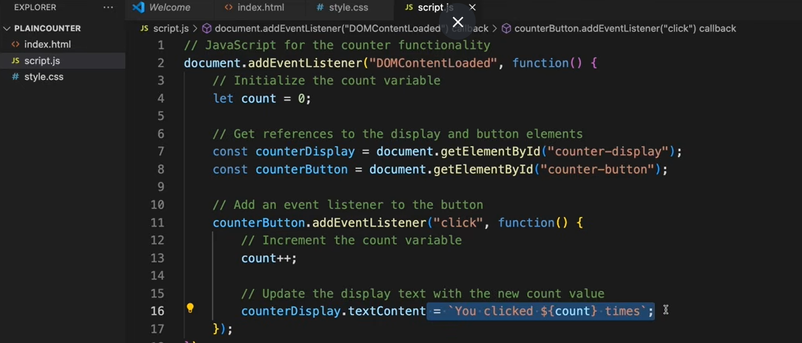
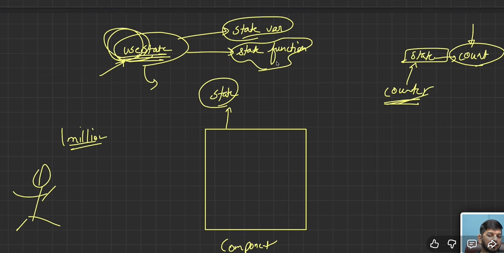
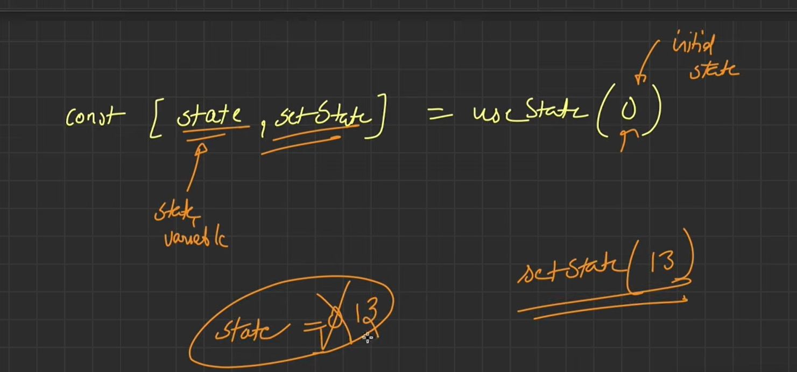
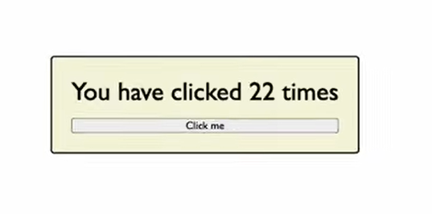
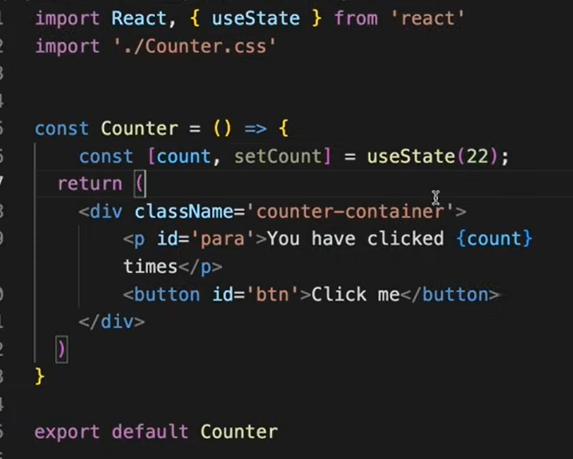
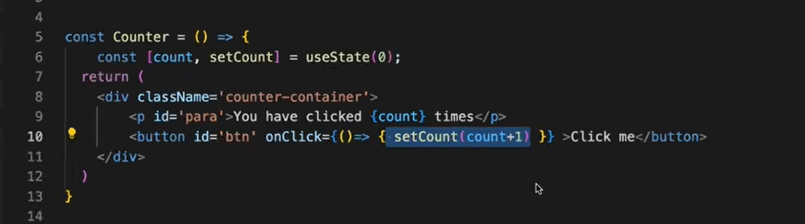

react kae features  ko utilize kae ka tarika hooks hai
yani react kae feature ko use karne ke liye hook ka use karte hai

by noraml js

use state 2 cheeche deta variable aur func jisee uski state ko update kar saktie hai

intial  0 hai fir 13 toh ab 13 kar dega

