PASSING PROPS AS CHILDREN AND FUNCTIONS

we already know

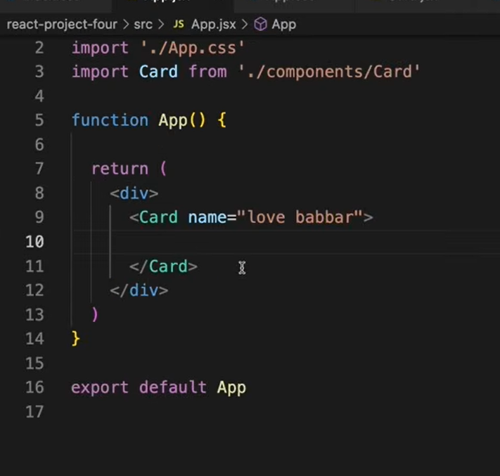

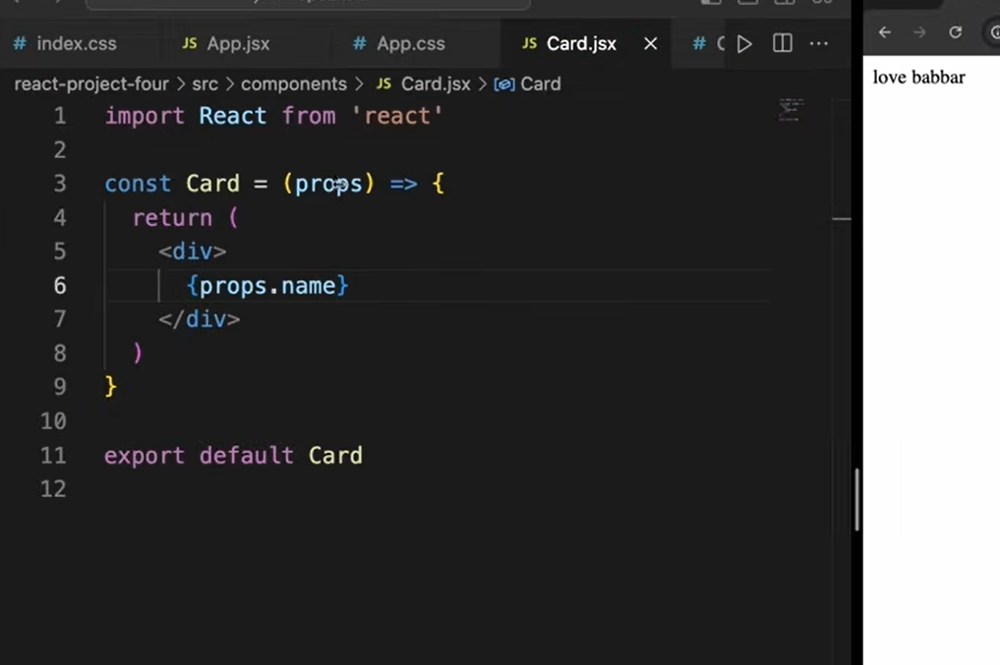

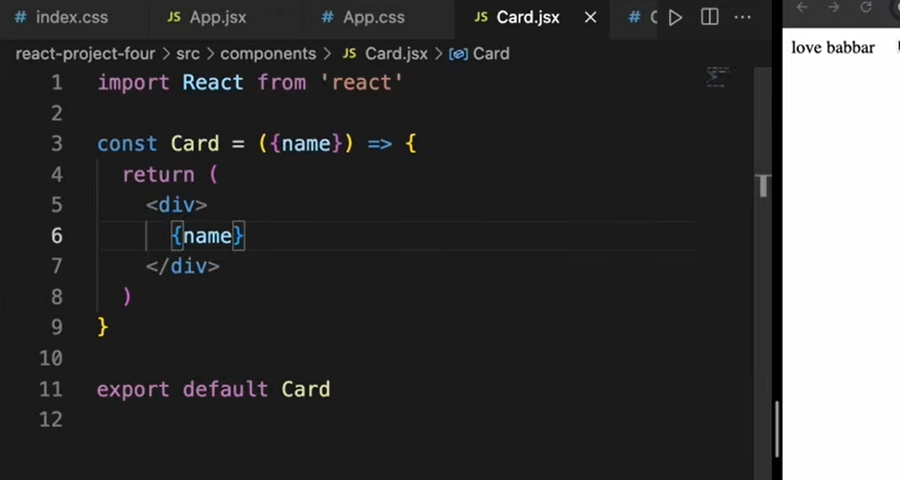

new thing to learn

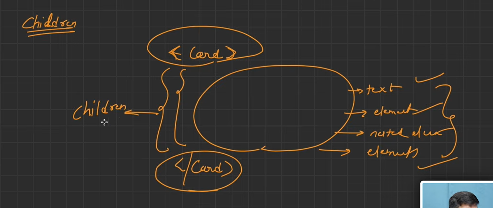

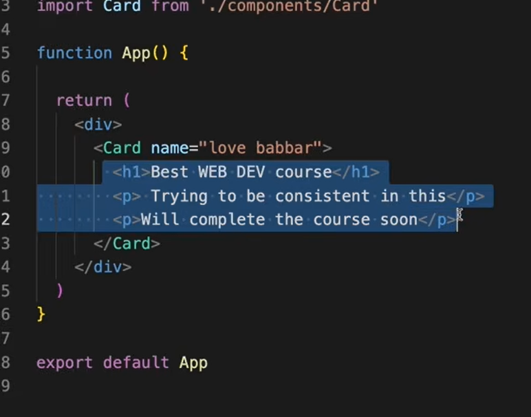

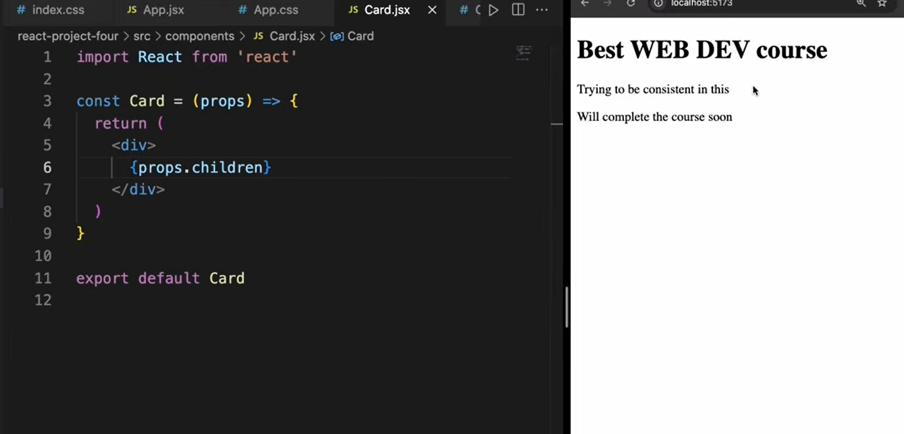

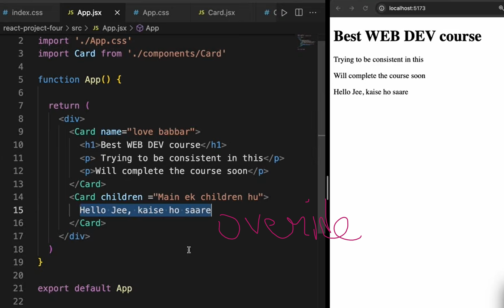

higher ordern component mai use and other 

app (parent) se child ko func pass kartue hai

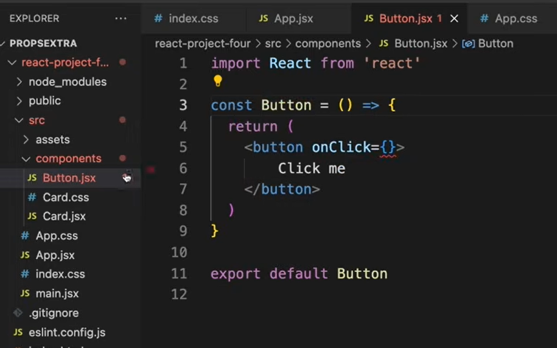

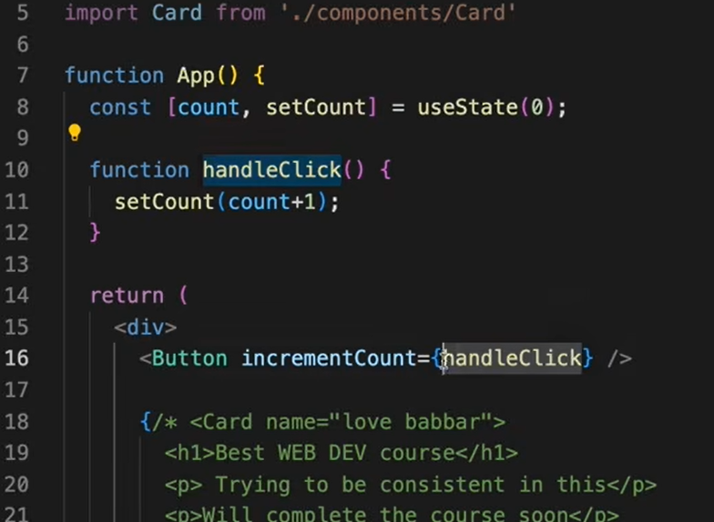

any name of the func 
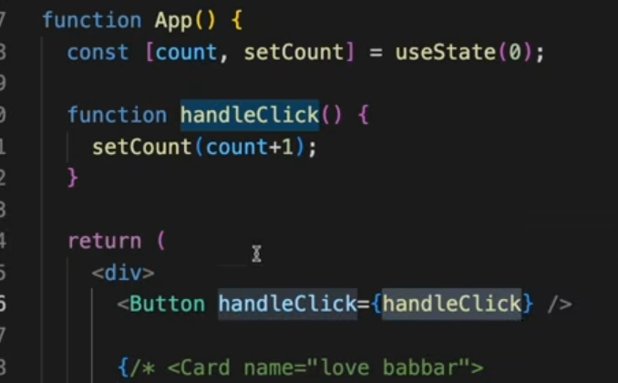

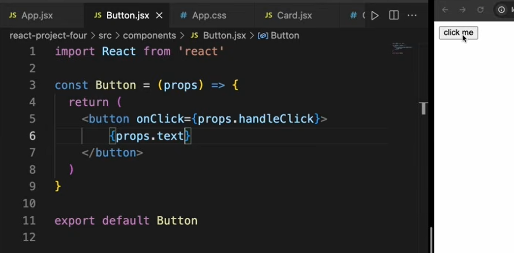
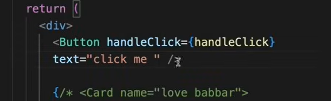

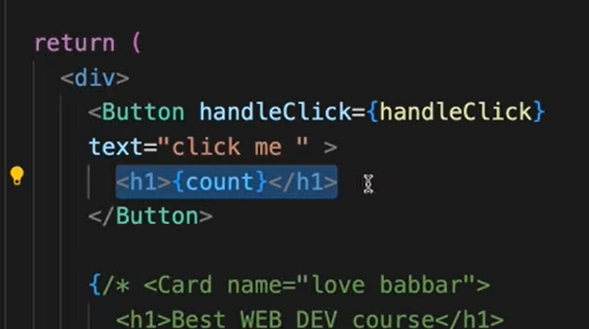

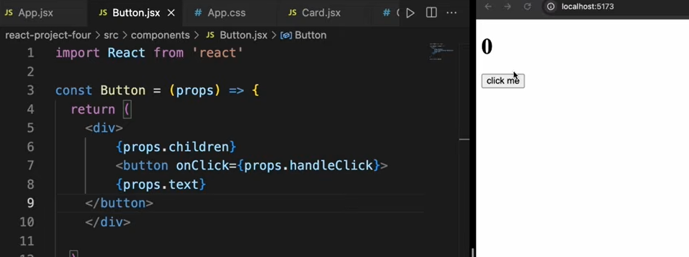

