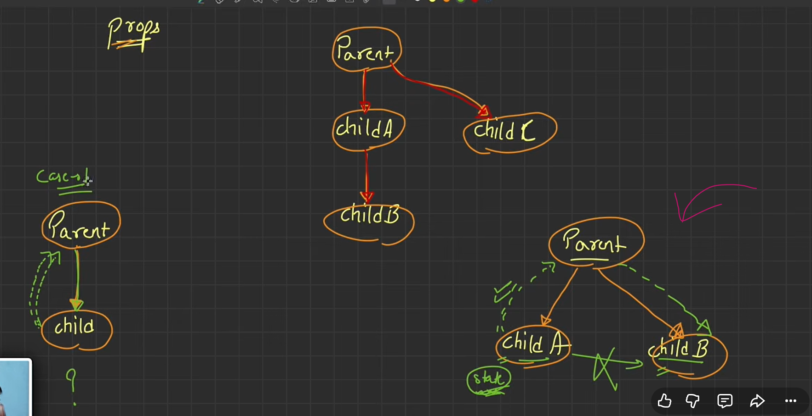
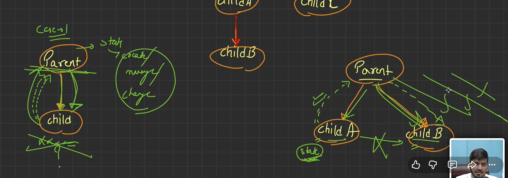
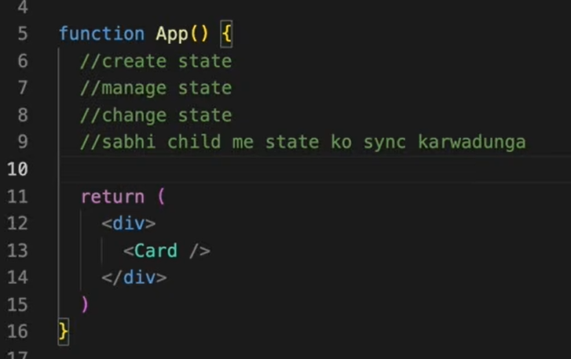
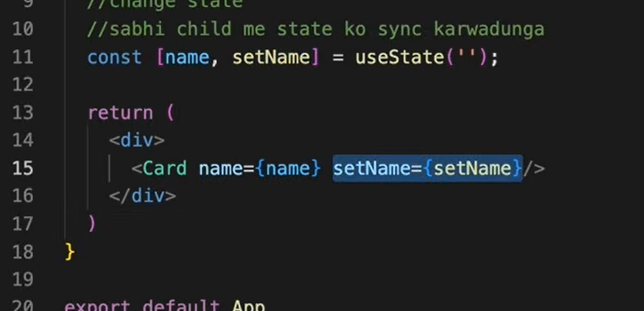
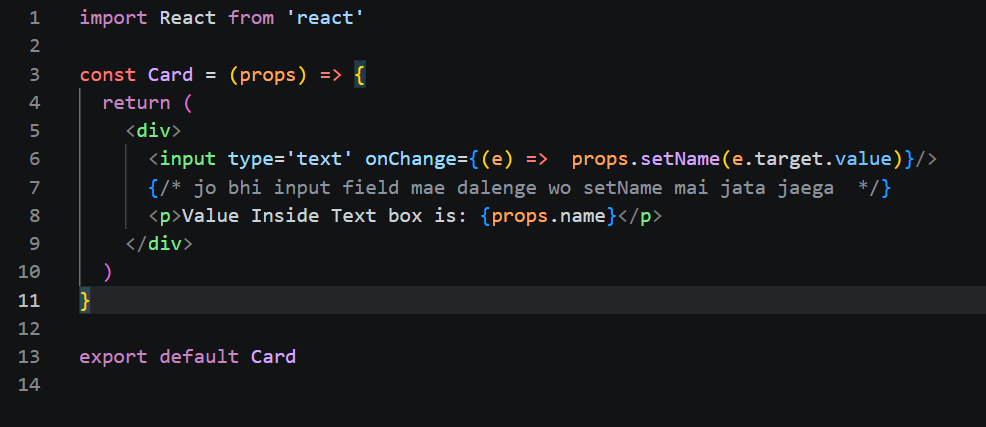
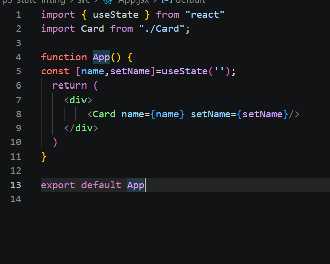
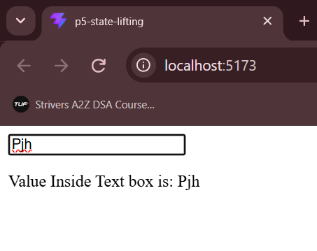
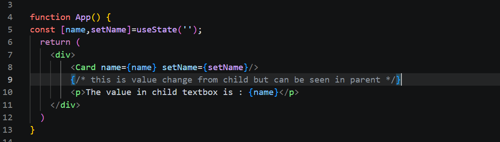
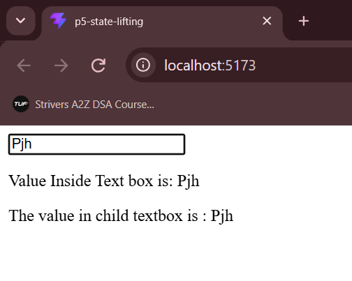
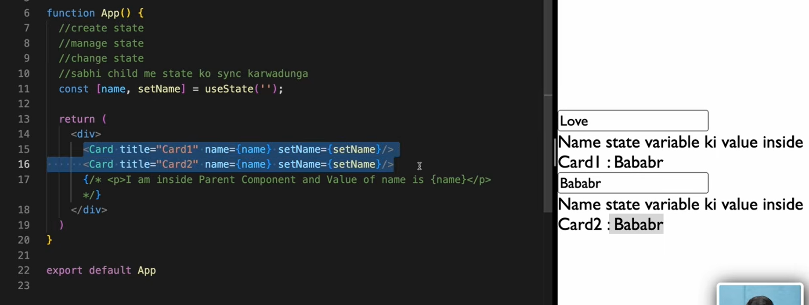

child se parent pass karna chate taki sibling other sibling ka data use kar sake

parent ko responsbilty de di state create aur sab karnie ki

har child ko acces de diya 

data ka + change karnie ka

ab sare sibling sync mai access change kar sakte

kha use hota
jab ek ko show karo toh dusre ko hide karna tab
 search wali chhejo mai
 