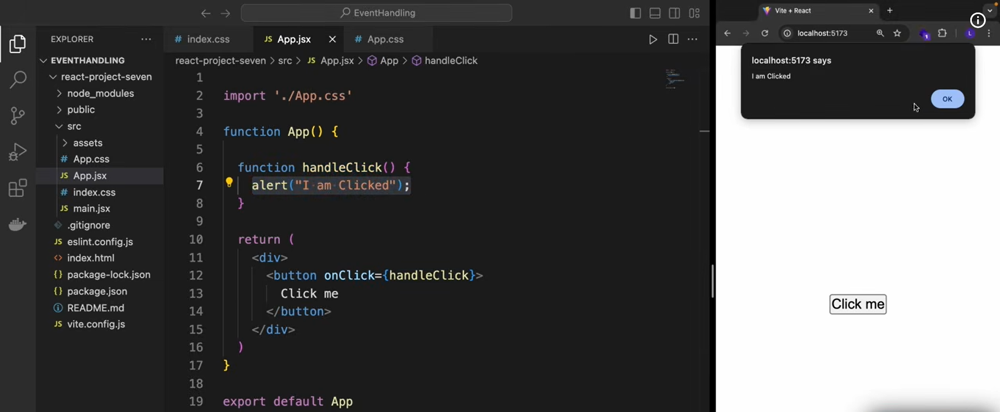
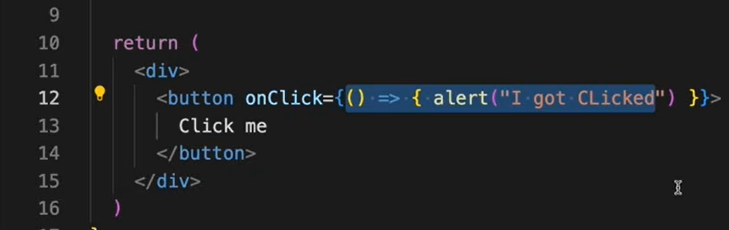
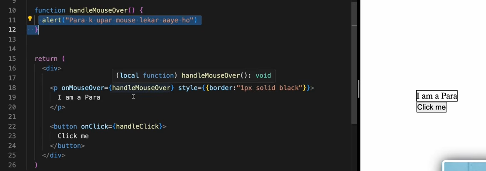
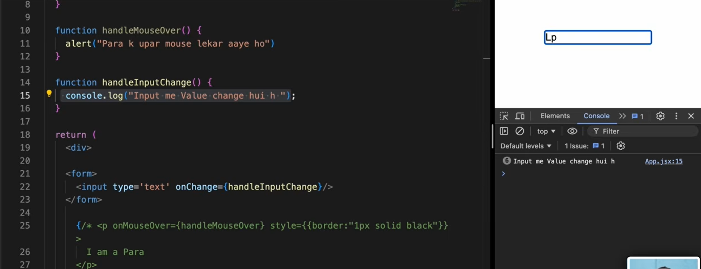
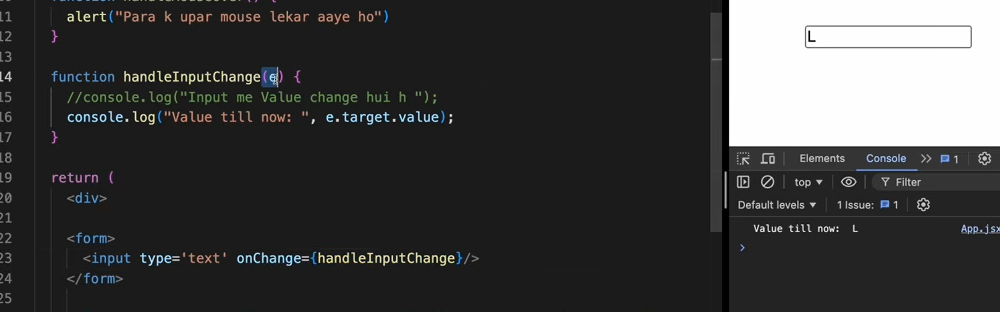
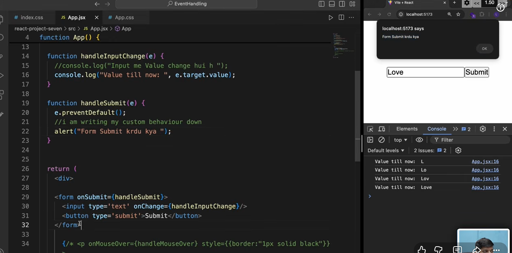
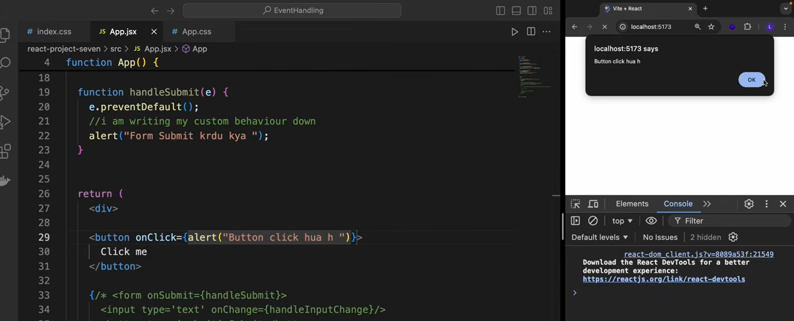
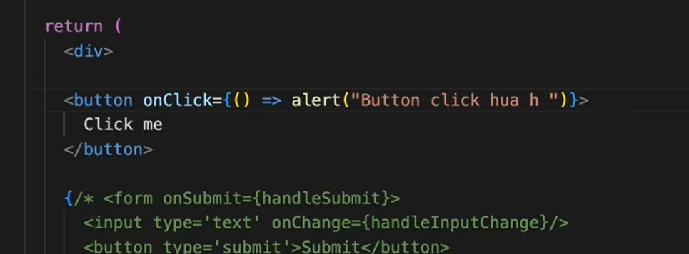
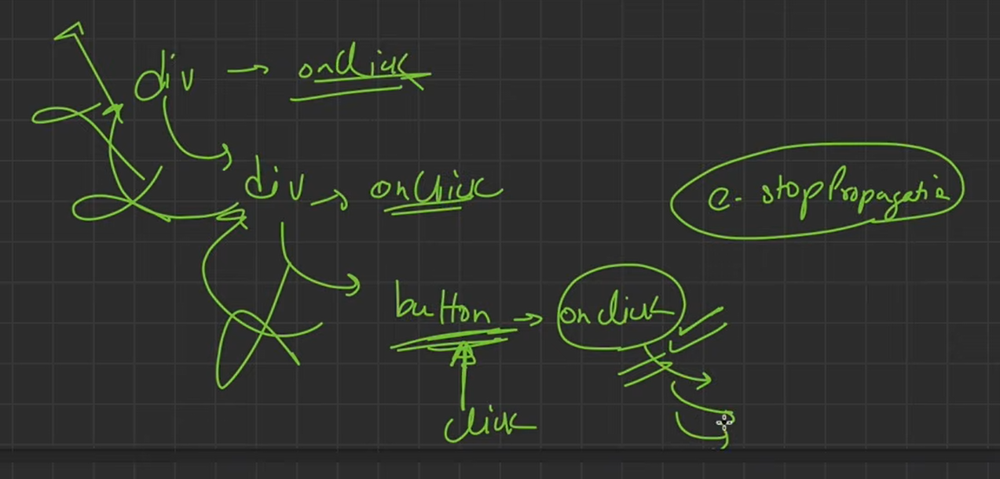

or direct

refresh reload nhi hone do mia khud ka cheej karunga prevent default se ye rokte

bina click kiye aa rha

bcs it is immediate invocation
component reder hote hi ye run hota BAD !!! 

now its working fine 

e.stop propogation taki upar na jae dom mai
